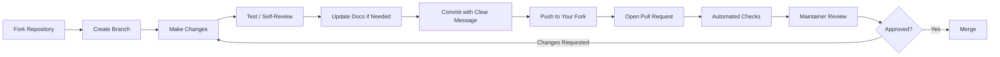

# 🤝 Contributing to the OSINT Mastery Guide Repository

Thank you for your interest in contributing to the official companion repository for **"A Complete Guide to Mastering Open-Source Intelligence (OSINT): Methods and Tools to Discover Critical Information, Data Protection, and Online Security."** This project exists because of community contributions, and every template, tool listing, script, and guide you add helps thousands of investigators, analysts, researchers, and cybersecurity professionals work more effectively and ethically.

This document explains how to propose changes, what we expect from contributions, and how the review process works. Please read it in full before opening your first pull request.

---

## 📋 Table of Contents

- [Code of Conduct](#code-of-conduct)
- [Ways to Contribute](#-ways-to-contribute)
- [Before You Start](#-before-you-start)
- [Development Environment Setup](#-development-environment-setup)
- [Contribution Workflow](#-contribution-workflow)
- [Content Standards](#-content-standards)
- [Style Guides](#-style-guides)
  - [Markdown Templates](#markdown-templates)
  - [Python Scripts](#python-scripts)
  - [Documentation](#documentation)
- [Legal and Ethical Requirements](#️-legal-and-ethical-requirements)
- [Review Process](#-review-process)
- [Recognition](#-recognition)
- [Getting Help](#-getting-help)

---

## Code of Conduct

This project and everyone participating in it is governed by our [Code of Conduct](CODE_OF_CONDUCT.md). By participating, you agree to uphold this code. Please report unacceptable behavior to <conduct@jambaacademy.com>.

---

## 🌟 Ways to Contribute

You don't need to be an OSINT expert or a professional developer to contribute meaningfully. Here are the main categories of contribution we welcome:

| Contribution Type | Examples | Skill Level |
|---|---|---|
| **📝 Template Creation** | New investigation report templates, checklists, planning documents | Beginner–Intermediate |
| **✏️ Template Improvement** | Fixing gaps, adding sections, improving clarity in existing templates | Beginner |
| **🛠️ Tool Documentation** | Adding new tools to the curated lists, updating dead links, correcting descriptions | Beginner |
| **🐍 Script Development** | Python/Bash automation for lawful, public-data OSINT workflows | Intermediate–Advanced |
| **📚 Documentation** | Tutorials, guides, glossary entries, FAQ improvements | Beginner–Intermediate |
| **🌍 Translation** | Translating templates and docs into additional languages | Beginner–Intermediate |
| **🐛 Bug Reports** | Broken links, formatting errors, factual inaccuracies | Beginner |
| **💡 Feature Requests** | Proposing new template categories or tool categories | Beginner |
| **📖 Case Studies** | Anonymized, ethically-sourced real-world investigation walkthroughs | Advanced |
| **🎨 Design Assets** | Diagrams, icons, and visual aids that follow the repo's theme | Intermediate |

If you're not sure where to start, look for issues tagged `good-first-issue` or `help-wanted` in the [Issues tab](https://github.com/JambaAcademy/OSINT/issues).

---

## 🚦 Before You Start

1. **Search existing issues and pull requests** to avoid duplicate work.
2. **Open an issue first** for anything larger than a small fix (new templates, new tool categories, new scripts) so maintainers can give early feedback on scope and direction before you invest significant time.
3. **Keep pull requests focused.** One template, one tool category, or one logical unit of work per PR. Large, sprawling PRs are difficult to review and are more likely to be rejected or delayed.
4. **Read the [Legal and Ethical Requirements](#️-legal-and-ethical-requirements)** section carefully — contributions that violate it will be rejected regardless of technical quality.

---

## 🔧 Development Environment Setup

```bash
# 1. Fork the repository via the GitHub UI, then clone your fork
git clone https://github.com/<your-username>/OSINT.git
cd OSINT

# 2. Add the upstream remote so you can sync with the main repo
git remote add upstream https://github.com/JambaAcademy/OSINT.git

# 3. Create a feature branch
git checkout -b feature/your-descriptive-branch-name

# 4. (For Python contributions) create an isolated environment
python3 -m venv .venv
source .venv/bin/activate        # Windows: .venv\Scripts\activate
pip install -r requirements-dev.txt
```

**Branch naming conventions:**

| Prefix | Use For |
|---|---|
| `feature/` | New templates, tools, or scripts |
| `fix/` | Corrections to existing content |
| `docs/` | Documentation-only changes |
| `translation/` | New or updated translations |
| `chore/` | Repo maintenance (link checks, formatting passes) |

Example: `feature/insurance-fraud-investigation-template`

---

## 🔄 Contribution Workflow



### Commit Message Format

We use a lightweight conventional-commit style:

```
<type>(<scope>): <short summary>

<optional longer description>

<optional footer, e.g. "Closes #123">
```

Types: `feat`, `fix`, `docs`, `style`, `refactor`, `test`, `chore`

Example:
```
feat(templates): add insurance fraud investigation report template

Adds a new specialized-formats template covering claim verification,
staged-incident indicators, and OSINT source documentation for
insurance SIU teams.

Closes #142
```

### Pull Request Checklist

Before submitting, confirm that:

- [ ] Your branch is up to date with `upstream/main`
- [ ] File names follow the [naming convention](#file-naming-convention) used elsewhere in the same folder
- [ ] New templates include all standard sections (see [Markdown Templates](#markdown-templates))
- [ ] Links have been checked and are not dead
- [ ] No real personal data, credentials, API keys, or proprietary material is included
- [ ] The PR description explains **what** changed and **why**
- [ ] Any new tool listing includes a one-line description, primary use case, and licensing/cost model (free, freemium, paid)

---

## ✅ Content Standards

All contributions must meet these baseline quality standards:

1. **Accuracy** — Information must be factually correct and current at time of submission. Tools change quickly; verify URLs and functionality before submitting.
2. **Completeness** — Templates should be usable "as-is" by simply filling in bracketed placeholders — no missing sections or half-finished tables.
3. **Neutrality** — Tool descriptions should be objective. Avoid marketing language; state capabilities and limitations plainly.
4. **Attribution** — Credit original authors, researchers, or projects where content is adapted or inspired by existing work.
5. **Accessibility** — Use plain language where possible. Define acronyms on first use in a document.
6. **No Duplication** — Check whether a similar template or tool listing already exists before adding a new one; propose an edit instead if so.

---

## 🎨 Style Guides

### File Naming Convention

Use lowercase, hyphen-separated names that describe content, not format:

```
✅ business-intelligence-report.md
✅ domain-website-analysis-report.md
❌ BizIntelReport.MD
❌ template_2_final_v3.md
```

### Markdown Templates

Every investigation/assessment template should include, at minimum:

1. A title (`#`) and one-line purpose statement
2. An **Executive Summary** block with key metadata fields (case ID, analyst, date, classification)
3. Numbered major sections (`## 1. ...`, `## 2. ...`) with consistent subsection numbering (`### 1.1 ...`)
4. Checklists (`- [ ]`) for procedural or source-verification steps
5. Tables for structured data (timelines, confidence ratings, findings)
6. A **Legal/Ethical Considerations** note relevant to that document type
7. A closing **classification / distribution / version control** block
8. Bracketed placeholders in the form `[Description of expected content]` — never pre-filled fictional data that could be mistaken for a real case

Use `---` horizontal rules to separate major sections and keep heading hierarchy consistent (H1 for title, H2 for major sections, H3 for subsections).

### Python Scripts

- Follow [PEP 8](https://peps.python.org/pep-0008/).
- Include a module-level docstring describing purpose, legal scope of use, and required inputs/outputs.
- All scripts must only interact with **publicly accessible, non-authenticated data sources** or documented, ToS-compliant APIs using the user's own API credentials.
- Include a `requirements.txt` entry or inline comment for any dependency.
- Add a `--help` flag via `argparse` for any command-line tool.
- No hardcoded credentials, tokens, or personal data — use environment variables or config file templates (`config.example.yaml`).
- Include basic error handling and rate-limit respect for any tool that queries external services.

### Documentation

- Use sentence case for headings (`## Getting started`, not `## Getting Started`) except where matching existing repo conventions in a given folder.
- Prefer numbered lists for sequential steps, bullet lists for non-sequential items.
- Include a "Last reviewed" date at the bottom of long-form guides.

---

## ⚖️ Legal and Ethical Requirements

This repository takes legal and ethical compliance seriously. **All contributions must:**

- Rely exclusively on **publicly available, lawfully accessible information** and respect the Terms of Service of any platform referenced.
- Avoid any content whose primary purpose is to **facilitate stalking, harassment, doxxing, unauthorized surveillance, or unauthorized access to systems or accounts.**
- Avoid instructions for bypassing authentication, exploiting vulnerabilities, or accessing non-public data without authorization.
- Include, where relevant, a reminder that investigators must obtain proper authorization and comply with applicable privacy laws (e.g., GDPR, CCPA) before conducting investigations involving personal data.
- Not include real, identifiable information about private individuals in example data — use clearly fictional placeholder names (e.g., "Jordan A. Sample") and fictional company names.

Contributions that violate these principles will be closed without merging. Repeat violations may result in the contributor being blocked from the repository. See [SECURITY.md](SECURITY.md) for how to report content that may have slipped through review.

---

## 👀 Review Process

1. **Automated checks** run on every PR (markdown linting, link checking, and file-naming validation).
2. **Maintainer triage** within 5–7 business days to confirm scope and assign a reviewer.
3. **Substantive review** — maintainers will comment directly on the PR. Please respond to all comments; PRs with no activity for 30 days after a review may be closed (you're welcome to reopen when ready).
4. **Approval and merge** — once approved by at least one maintainer, your PR will be merged into `main` and included in the next release noted in [CHANGELOG.md](CHANGELOG.md).

We aim to be constructive and specific in feedback. Disagreement about content is normal — please engage in good faith, and remember that the final editorial decision rests with the maintainers to keep the repository coherent and safe.

---

## 🏆 Recognition

- All merged contributors are added to the repository's contributor graph and, for substantial contributions, the acknowledgments section of the README.
- Significant recurring contributors may be invited to join as repository collaborators with direct review privileges.
- With permission, we highlight standout community templates in release notes and on the Jamba Academy social channels.

---

## 🆘 Getting Help

- **General questions:** open a [Discussion](https://github.com/JambaAcademy/OSINT/discussions)
- **Bug reports:** open an [Issue](https://github.com/JambaAcademy/OSINT/issues) using the bug report template
- **Security concerns:** see [SECURITY.md](SECURITY.md) — do not open a public issue for vulnerabilities
- **Direct contact:** <contribute@jambaacademy.com>

---

*Thank you for helping make ethical, professional OSINT education accessible to everyone. Every contribution — no matter how small — makes this resource better.*

**Maintained by:** Jamba Academy OSINT Team
**Document version:** 1.0
