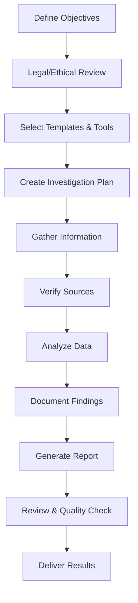

# 🔍 Complete OSINT Mastery Repository

[](https://opensource.org/licenses/MIT)
[](https://github.com/JambaAcademy/osint-mastery-guide/stargazers)
[](https://github.com/JambaAcademy/osint-mastery-guide/network)
[](https://github.com/JambaAcademy/osint-mastery-guide/graphs/contributors)
[](https://github.com/JambaAcademy/osint-mastery-guide/commits/main)

> **The definitive collection of OSINT templates and tools for modern intelligence gathering and analysis**

This repository serves as the official companion to the book **"A Complete Guide to Mastering Open-Source Intelligence (OSINT): Methods and Tools to Discover Critical Information, Data Protection, and Online Security"** - available on [Amazon](https://amazon.com) and major digital stores.

---

## 📖 About This Repository

In today's data-driven world, Open-Source Intelligence (OSINT) has become an essential skill for cybersecurity professionals, investigators, journalists, researchers, and business analysts. This repository provides a comprehensive collection of professional-grade templates and cutting-edge tools designed to streamline your OSINT operations and enhance your investigative capabilities.

### 🎯 Repository Objectives

- **Standardize OSINT Reporting**: Professional templates for consistent, court-ready documentation
- **Accelerate Investigations**: Ready-to-use tools and methodologies to reduce analysis time
- **Ensure Best Practices**: Ethical guidelines and legal compliance frameworks
- **Foster Community Learning**: Open-source collaboration for continuous improvement
- **Bridge Theory to Practice**: Practical implementation of academic OSINT principles

---

## 📚 Book Overview

**"A Complete Guide to Mastering Open-Source Intelligence (OSINT)"** is the authoritative resource for modern intelligence gathering, updated for 2025 with the latest AI-driven methodologies and tools.

### 🌟 Key Features

- **🤖 AI-Enhanced OSINT**: Cutting-edge artificial intelligence tools and techniques
- **📊 Comprehensive Coverage**: 15+ investigation categories with detailed strategies
- **🔒 Security-First Approach**: Data protection and online security best practices
- **⚖️ Ethical Framework**: Legal compliance and ethical investigation guidelines
- **🎯 Practical Applications**: Real-world case studies and examples
- **🛠️ Tool Mastery**: In-depth coverage of 100+ OSINT tools and platforms

### 🕵️ Investigation Categories Covered

| Category | Focus Areas | Professional Applications |
|----------|-------------|--------------------------|
| **👥 People Investigation** | Identity verification, background checks, social footprints | HR screening, due diligence, security clearance |
| **🏢 Business Intelligence** | Corporate analysis, competitive research, market insights | Investment research, partnership evaluation |
| **🏠 Property Records** | Real estate analysis, ownership verification, asset tracking | Legal investigations, financial analysis |
| **🚗 Vehicle Intelligence** | Registration data, ownership history, location tracking | Insurance fraud, asset recovery |
| **💰 Financial Analysis** | Asset discovery, transaction patterns, regulatory compliance | Anti-money laundering, fraud detection |
| **💍 Personal Records** | Marriage/divorce records, family connections, legal proceedings | Background verification, genealogy research |
| **📱 Social Media Analysis** | Platform intelligence, sentiment analysis, network mapping | Brand monitoring, threat assessment |
| **💼 Employment Verification** | Career history, professional credentials, workplace intelligence | Recruitment, competitor analysis |
| **🌐 Digital Footprints** | Online presence analysis, data breach exposure | Cybersecurity assessment, privacy auditing |
| **🔍 Deep Web Research** | Hidden services, specialized databases, academic resources | Academic research, specialized investigations |

---

## 🗂️ Repository Structure

```
📦 osint-mastery-guide/
├── 📄 README.md                    # This comprehensive guide
├── 📄 LICENSE                      # MIT License terms
├── 📄 CONTRIBUTING.md               # Contribution guidelines
├── 📄 CODE_OF_CONDUCT.md           # Community standards
├── 📄 CHANGELOG.md                 # Version history
├── 📄 SECURITY.md                  # Security policy
├── 
├── 📁 osint-templates/             # Professional OSINT Templates
│   ├── 📄 README.md               # Templates documentation
│   ├── 📁 investigation-reports/  # Investigation report templates
│   │   ├── 📄 person-investigation-report.md
│   │   ├── 📄 business-intelligence-report.md
│   │   ├── 📄 social-media-analysis-report.md
│   │   ├── 📄 digital-footprint-assessment.md
│   │   ├── 📄 asset-investigation-report.md
│   │   ├── 📄 threat-intelligence-report.md
│   │   ├── 📄 breach-analysis-report.md
│   │   └── 📄 comprehensive-background-check.md
│   ├── 📁 technical-assessments/   # Technical analysis templates
│   │   ├── 📄 network-reconnaissance-report.md
│   │   ├── 📄 domain-website-analysis-report.md
│   │   ├── 📄 infrastructure-assessment.md
│   │   ├── 📄 vulnerability-intelligence-report.md
│   │   ├── 📄 malware-analysis-report.md
│   │   └── 📄 incident-response-template.md
│   ├── 📁 operational-planning/    # Planning and methodology templates
│   │   ├── 📄 osint-collection-plan.md
│   │   ├── 📄 investigation-workflow.md
│   │   ├── 📄 risk-assessment-matrix.md
│   │   ├── 📄 legal-compliance-checklist.md
│   │   ├── 📄 source-verification-framework.md
│   │   └── 📄 evidence-chain-custody.md
│   ├── 📁 specialized-formats/     # Specialized investigation templates
│   │   ├── 📄 court-ready-report.md
│   │   ├── 📄 executive-summary.md
│   │   ├── 📄 regulatory-compliance-report.md
│   │   ├── 📄 insurance-investigation.md
│   │   ├── 📄 academic-research-template.md
│   │   └── 📄 journalism-fact-check.md
│   └── 📁 ai-assisted-templates/   # AI-enhanced investigation templates
│       ├── 📄 ai-pattern-analysis.md
│       ├── 📄 automated-data-correlation.md
│       ├── 📄 sentiment-analysis-report.md
│       ├── 📄 predictive-intelligence.md
│       └── 📄 machine-learning-insights.md
├── 
├── 📁 osint-tools/                 # Modern OSINT Tools & Technologies
│   ├── 📄 README.md               # Tools documentation
│   ├── 📁 search-and-discovery/   # Search engines and discovery tools
│   │   ├── 📁 advanced-search-engines/
│   │   ├── 📁 specialized-databases/
│   │   ├── 📁 academic-resources/
│   │   └── 📁 government-databases/
│   ├── 📁 social-media-intelligence/  # Social media analysis tools
│   │   ├── 📁 platform-specific-tools/
│   │   ├── 📁 cross-platform-analyzers/
│   │   ├── 📁 sentiment-analysis/
│   │   └── 📁 network-mapping/
│   ├── 📁 technical-reconnaissance/   # Technical analysis tools
│   │   ├── 📁 domain-analysis/
│   │   ├── 📁 network-scanning/
│   │   ├── 📁 certificate-analysis/
│   │   └── 📁 infrastructure-mapping/
│   ├── 📁 people-investigation/    # Person-focused investigation tools
│   │   ├── 📁 identity-verification/
│   │   ├── 📁 background-checking/
│   │   ├── 📁 contact-discovery/
│   │   └── 📁 relationship-mapping/
│   ├── 📁 business-intelligence/   # Corporate investigation tools
│   │   ├── 📁 company-research/
│   │   ├── 📁 financial-analysis/
│   │   ├── 📁 regulatory-monitoring/
│   │   └── 📁 competitive-intelligence/
│   ├── 📁 geospatial-intelligence/ # Location-based analysis tools
│   │   ├── 📁 mapping-platforms/
│   │   ├── 📁 satellite-imagery/
│   │   ├── 📁 location-tracking/
│   │   └── 📁 geographic-correlation/
│   ├── 📁 ai-powered-tools/        # Artificial Intelligence OSINT tools
│   │   ├── 📁 machine-learning/
│   │   ├── 📁 natural-language-processing/
│   │   ├── 📁 image-recognition/
│   │   ├── 📁 pattern-analysis/
│   │   └── 📁 automated-reporting/
│   ├── 📁 data-visualization/      # Analysis and presentation tools
│   │   ├── 📁 link-analysis/
│   │   ├── 📁 timeline-creation/
│   │   ├── 📁 network-diagrams/
│   │   └── 📁 interactive-dashboards/
│   ├── 📁 privacy-and-security/    # Privacy protection and security tools
│   │   ├── 📁 anonymization-tools/
│   │   ├── 📁 vpn-tor-setup/
│   │   ├── 📁 secure-communications/
│   │   └── 📁 operational-security/
│   └── 📁 mobile-and-iot/          # Mobile device and IoT investigation
│       ├── 📁 mobile-forensics/
│       ├── 📁 app-analysis/
│       ├── 📁 iot-discovery/
│       └── 📁 wireless-intelligence/
├── 
├── 📁 documentation/               # Additional documentation and guides
│   ├── 📁 getting-started/        # Beginner guides and tutorials
│   ├── 📁 advanced-techniques/    # Expert-level methodologies
│   ├── 📁 legal-and-ethics/       # Legal compliance and ethical guidelines
│   ├── 📁 case-studies/           # Real-world application examples
│   ├── 📁 training-materials/     # Educational resources and exercises
│   └── 📁 reference-guides/       # Quick reference cards and checklists
├── 
├── 📁 scripts-and-automation/     # Automation scripts and utilities
│   ├── 📁 python-scripts/         # Python automation tools
│   ├── 📁 bash-utilities/         # Shell scripts and utilities
│   ├── 📁 api-integrations/       # API connection scripts
│   └── 📁 data-processing/        # Data analysis and processing tools
├── 
└── 📁 community/                  # Community resources
    ├── 📁 contributions/          # Community-contributed content
    ├── 📁 discussions/            # Discussion topics and Q&A
    ├── 📁 events/                 # Workshops, webinars, and conferences
    └── 📁 resources/              # Additional learning resources
```

---

## 🚀 Quick Start Guide

### Prerequisites

Before diving into OSINT investigations, ensure you have:

- **📚 Foundational Knowledge**: Basic understanding of internet protocols, databases, and search techniques
- **⚖️ Legal Awareness**: Familiarity with local privacy laws and ethical investigation practices
- **🔐 Security Setup**: Secure investigation environment with VPN, encrypted communications
- **🛠️ Essential Tools**: Modern web browser, note-taking application, screenshot capabilities

### 🎯 Getting Started

1. **📖 Read the Book**: Start with "A Complete Guide to Mastering OSINT" for comprehensive foundation
2. **📋 Choose Your Template**: Select appropriate templates from `/osint-templates/` based on investigation type
3. **🔧 Setup Tools**: Install and configure tools from `/osint-tools/` relevant to your objectives
4. **📝 Plan Your Investigation**: Use planning templates to structure your approach
5. **🔍 Begin Investigation**: Follow systematic methodology with proper documentation
6. **📊 Analyze and Report**: Use analysis templates to present findings professionally

### 🆘 First Investigation Workflow



---

## 📋 Template Categories

### 🕵️ Investigation Reports
Professional templates for comprehensive investigative documentation:

- **👤 Person Investigation Report**: Complete individual background analysis
- **🏢 Business Intelligence Report**: Corporate research and competitive analysis
- **📱 Social Media Analysis Report**: Platform-specific intelligence gathering
- **👣 Digital Footprint Assessment**: Online presence and exposure analysis
- **💎 Asset Investigation Report**: Financial and property intelligence
- **🚨 Threat Intelligence Report**: Security-focused threat assessment
- **🛡️ Breach Analysis Report**: Data breach investigation and impact analysis
- **📋 Comprehensive Background Check**: Multi-source verification template

### 🔧 Technical Assessments
Specialized templates for technical intelligence gathering:

- **🌐 Network Reconnaissance Report**: Infrastructure analysis and mapping
- **🌍 Domain & Website Analysis Report**: Web property investigation
- **🏗️ Infrastructure Assessment**: Technology stack and security analysis
- **🔍 Vulnerability Intelligence Report**: Security weakness identification
- **🦠 Malware Analysis Report**: Malicious software investigation
- **🚨 Incident Response Template**: Security incident documentation

### 📊 Operational Planning
Strategic planning and methodology templates:

- **📅 OSINT Collection Plan**: Systematic information gathering strategy
- **⚡ Investigation Workflow**: Step-by-step investigation methodology
- **⚖️ Risk Assessment Matrix**: Risk evaluation and mitigation planning
- **📜 Legal Compliance Checklist**: Regulatory adherence verification
- **✅ Source Verification Framework**: Information validation methodology
- **🔗 Evidence Chain of Custody**: Legal evidence handling procedures

---

## 🛠️ Tool Categories

### 🔍 Search and Discovery
Advanced search engines and specialized databases for comprehensive information gathering:

- **🔎 Advanced Search Engines**: Google dorking, Bing intelligence, specialized search platforms
- **🗄️ Specialized Databases**: Industry-specific, academic, and government databases
- **🎓 Academic Resources**: Research publications, thesis databases, educational platforms
- **🏛️ Government Databases**: Public records, regulatory filings, official documents

### 📱 Social Media Intelligence
Platform-specific analysis tools and cross-platform intelligence gathering:

- **📊 Platform-Specific Tools**: Facebook, Twitter, LinkedIn, Instagram, TikTok analyzers
- **🌐 Cross-Platform Analyzers**: Multi-platform correlation and analysis tools
- **💭 Sentiment Analysis**: Opinion mining and emotional intelligence tools
- **🗺️ Network Mapping**: Social graph analysis and relationship visualization

### 🔧 Technical Reconnaissance
Infrastructure analysis and technical intelligence gathering:

- **🌐 Domain Analysis**: WHOIS, DNS, certificate transparency tools
- **📡 Network Scanning**: Port scanning, service enumeration, vulnerability assessment
- **🔐 Certificate Analysis**: SSL/TLS analysis, certificate transparency logs
- **🗺️ Infrastructure Mapping**: Network topology, hosting analysis, CDN detection

### 👥 People Investigation
Person-focused investigation and identity verification tools:

- **🆔 Identity Verification**: Name, address, phone number validation tools
- **🔍 Background Checking**: Criminal records, employment history, education verification
- **📞 Contact Discovery**: Email, phone number, social media profile discovery
- **👨‍👩‍👧‍👦 Relationship Mapping**: Family connections, professional networks, associate analysis

---

## 🤖 AI-Powered OSINT Tools

### 🧠 Machine Learning Applications
Artificial intelligence tools revolutionizing OSINT investigations:

- **🔍 Pattern Recognition**: Automated anomaly detection and behavioral analysis
- **📊 Data Correlation**: Cross-source information linking and relationship discovery
- **📈 Predictive Analytics**: Trend analysis and forecasting capabilities
- **🎯 Automated Targeting**: Intelligent lead generation and priority scoring

### 🗣️ Natural Language Processing
Text analysis and linguistic intelligence tools:

- **📝 Document Analysis**: Automated report generation and summarization
- **🌍 Language Translation**: Multi-language investigation capabilities
- **💭 Sentiment Mining**: Opinion analysis and emotional intelligence
- **🏷️ Entity Extraction**: Automated identification of people, places, organizations

### 👁️ Image and Video Intelligence
Visual analysis and multimedia investigation tools:

- **🔍 Reverse Image Search**: Advanced image matching and source identification
- **👤 Facial Recognition**: Identity verification through facial analysis
- **📍 Geolocation Analysis**: Location identification through visual cues
- **🎥 Video Analysis**: Frame-by-frame analysis and content extraction

---

## 📚 Documentation and Learning Resources

### 🎓 Getting Started
Comprehensive guides for OSINT beginners:

- **📖 OSINT Fundamentals**: Core concepts, terminology, and principles
- **🛠️ Tool Installation Guides**: Step-by-step setup instructions
- **⚖️ Legal and Ethical Guidelines**: Compliance frameworks and best practices
- **🎯 First Investigation Tutorial**: Hands-on learning with practical examples

### 🎯 Advanced Techniques
Expert-level methodologies and specialized approaches:

- **🕵️ Advanced Investigation Strategies**: Complex case methodologies
- **🤖 AI Integration Techniques**: Leveraging artificial intelligence in investigations
- **🔐 Advanced Privacy Protection**: Sophisticated operational security measures
- **📊 Big Data Analysis**: Handling large-scale information processing

### 📋 Case Studies
Real-world applications and lessons learned:

- **🏢 Corporate Intelligence Cases**: Business investigation examples
- **🕵️ Personal Investigation Studies**: Individual research case studies
- **🚨 Security Incident Analysis**: Breach investigation examples
- **📺 Media and Journalism Cases**: Fact-checking and verification examples

---

## 🤝 Contributing to the Repository

We welcome contributions from the OSINT community! Here's how you can help:

### 🌟 Ways to Contribute

- **📝 Template Improvements**: Enhance existing templates or create new ones
- **🛠️ Tool Recommendations**: Suggest new tools or update existing tool information
- **📚 Documentation**: Improve guides, tutorials, and documentation
- **🐛 Bug Reports**: Report issues or suggest improvements
- **💡 Feature Requests**: Propose new features or enhancements
- **🌍 Translations**: Help make resources available in multiple languages

### 📋 Contribution Process

1. **🍴 Fork the Repository**: Create your own copy of the repository
2. **🌿 Create Feature Branch**: `git checkout -b feature/your-feature-name`
3. **✍️ Make Changes**: Add your contributions following our style guide
4. **✅ Test Changes**: Ensure all templates and tools work as expected
5. **📝 Update Documentation**: Update relevant documentation and README files
6. **🔀 Submit Pull Request**: Create a pull request with detailed description
7. **👥 Code Review**: Collaborate with maintainers during review process

### 📏 Contribution Guidelines

- **Quality Standards**: Maintain high-quality, professional-grade content
- **Legal Compliance**: Ensure all contributions comply with applicable laws
- **Ethical Standards**: Uphold ethical investigation practices
- **Documentation**: Provide clear documentation for all contributions
- **Testing**: Thoroughly test all tools and templates before submission
- **Attribution**: Properly credit sources and original authors

---

## ⚖️ Legal and Ethical Considerations

### 📜 Legal Compliance

This repository emphasizes legal and ethical OSINT practices:

- **🌍 Jurisdictional Awareness**: Understanding local laws and regulations
- **🔒 Privacy Protection**: Respecting individual privacy rights
- **📋 Terms of Service**: Complying with platform terms and conditions
- **⚖️ Evidence Standards**: Maintaining legal admissibility of collected information
- **📝 Documentation Requirements**: Proper chain of custody and documentation

### 🎯 Ethical Framework

Our ethical guidelines ensure responsible OSINT practice:

- **🎯 Purpose Limitation**: Conducting investigations only for legitimate purposes
- **⚖️ Proportionality**: Using methods proportionate to investigation objectives
- **🔒 Data Minimization**: Collecting only necessary information
- **📊 Accuracy**: Ensuring information accuracy and source verification
- **🤐 Confidentiality**: Protecting sensitive information and sources

### ⚠️ Important Disclaimer

> **This repository is for educational and professional use only. Users are responsible for ensuring their OSINT activities comply with applicable laws and ethical standards. The authors and contributors are not responsible for any misuse of the provided resources.**

---

## 🛡️ Privacy and Security

### 🔐 Operational Security (OPSEC)

Protecting yourself during OSINT investigations:

- **🌐 Network Security**: VPN usage, Tor networks, secure connections
- **💻 System Security**: Isolated investigation environments, secure operating systems
- **📱 Communication Security**: Encrypted messaging, secure email, anonymous communications
- **🗄️ Data Protection**: Encrypted storage, secure backup procedures, data retention policies

### 🔍 Investigation Security

Protecting investigation integrity and sources:

- **🤐 Source Protection**: Anonymizing sources and protecting informants
- **📊 Data Integrity**: Maintaining chain of custody and evidence integrity
- **🔒 Access Control**: Limiting access to sensitive investigation materials
- **📝 Documentation Security**: Secure storage and transmission of reports

---

## 📞 Support and Community

### 🆘 Getting Help

- **📚 Documentation**: Comprehensive guides and tutorials in `/documentation/`
- **💬 Community Discussions**: GitHub Issues and Discussion forums
- **📧 Direct Contact**: [osint-support@jambaacademy.com](mailto:osint-support@jambaacademy.com)
- **🌐 Official Website**: [www.jambaacademy.com](https://www.jambaacademy.com)
- **📱 Social Media**: Follow us for updates and community news

### 👥 Community Guidelines

- **🤝 Respect**: Treat all community members with respect and professionalism
- **📚 Learning**: Foster a supportive learning environment
- **🤝 Collaboration**: Encourage knowledge sharing and collaboration
- **⚖️ Ethics**: Maintain high ethical standards in all discussions
- **📝 Quality**: Contribute high-quality, well-researched content

### 🎓 Training and Certification

- **📖 Book Study Groups**: Community-organized study sessions
- **🎯 Practical Workshops**: Hands-on training and skill development
- **🏆 Certification Programs**: Professional OSINT certification pathways
- **🎤 Guest Speakers**: Industry expert presentations and Q&A sessions

---

## 🗂️ Additional Resources

### 📚 Recommended Reading

- **📖 "A Complete Guide to Mastering OSINT"** - The comprehensive foundation text
- **📚 Academic Papers**: Latest research in intelligence gathering and analysis
- **📰 Industry Publications**: Current trends and developments in OSINT
- **📖 Legal Resources**: Privacy law, investigation regulations, compliance guides

### 🔗 Useful Links

- **🛒 Book Purchase**: [Amazon](https://amazon.com) | [Barnes & Noble](https://barnesandnoble.com) | [Digital Stores](https://digitalstores.com)
- **🎓 Jamba Academy**: [Official Website](https://jambaacademy.com)
- **💼 Professional Services**: [OSINT Consulting](https://jambaacademy.com/consulting)
- **🎯 Training Programs**: [Certification Courses](https://jambaacademy.com/training)

### 🌐 Professional Networks

- **💼 LinkedIn Groups**: OSINT professionals and practitioners
- **🐦 Twitter Communities**: Real-time OSINT news and discussions
- **💬 Discord Servers**: Interactive community discussions and support
- **📰 Forums**: Specialized OSINT discussion boards and knowledge sharing

---

## 📈 Repository Statistics

### 📊 Usage Metrics

- **⭐ Stars**: Track repository popularity and community interest
- **🍴 Forks**: Monitor community adoption and customization
- **👥 Contributors**: Growing community of OSINT professionals
- **📈 Downloads**: Template and tool usage statistics
- **🌍 Global Reach**: International community of users and contributors

### 📅 Update Schedule

- **🔄 Regular Updates**: Monthly tool updates and template improvements
- **📚 Book Alignment**: Synchronized with book editions and updates
- **🆕 New Features**: Quarterly addition of new templates and tools
- **🐛 Bug Fixes**: Immediate response to reported issues
- **🌟 Community Requests**: Regular implementation of community suggestions

---

## 🏆 Acknowledgments

### 👏 Contributors

Special thanks to all community members who have contributed to this repository:

- **🎓 Academic Researchers**: Providing theoretical foundations and research insights
- **💼 Industry Professionals**: Sharing practical experience and real-world applications
- **🛠️ Tool Developers**: Creating and maintaining OSINT tools and utilities
- **📝 Documentation Writers**: Improving guides, tutorials, and educational content
- **🔍 Beta Testers**: Testing templates and tools, providing valuable feedback

### 🏢 Partner Organizations

- **🎓 Academic Institutions**: Research partnerships and educational collaboration
- **🏛️ Government Agencies**: Legal guidance and compliance framework development
- **💼 Industry Partners**: Tool integration and professional development programs
- **🌐 Open Source Community**: Collaborative development and knowledge sharing

---

## 📜 License and Terms

### 📄 License Information

This repository is licensed under the **MIT License**, which allows for:

- ✅ **Commercial Use**: Use in commercial projects and professional services
- ✅ **Modification**: Customize templates and tools for specific needs
- ✅ **Distribution**: Share with colleagues and in professional networks
- ✅ **Private Use**: Internal organizational use and customization

### ⚠️ Terms and Conditions

By using this repository, you agree to:

- **⚖️ Legal Compliance**: Use all resources in compliance with applicable laws
- **🎯 Ethical Standards**: Maintain high ethical standards in all OSINT activities
- **📝 Attribution**: Provide appropriate credit when using or modifying resources
- **🔒 Responsibility**: Accept full responsibility for your use of provided resources

### 🚫 Limitations

- **No Warranty**: Resources provided "as-is" without warranty or guarantee
- **No Liability**: Authors not responsible for any consequences of resource usage
- **Updates**: No guarantee of continued maintenance or updates
- **Accuracy**: Users responsible for verifying accuracy and suitability

---

## 📞 Contact Information

### 📧 Direct Contact

- **📧 General Inquiries**: [info@jambaacademy.com](mailto:info@jambaacademy.com)
- **🛠️ Technical Support**: [support@jambaacademy.com](mailto:support@jambaacademy.com)
- **🤝 Partnership Opportunities**: [partnerships@jambaacademy.com](mailto:partnerships@jambaacademy.com)
- **📚 Academic Collaboration**: [research@jambaacademy.com](mailto:research@jambaacademy.com)

### 🌐 Online Presence

- **🏠 Website**: [www.jambaacademy.com](https://jambaacademy.com)
- **💼 LinkedIn**: [Jamba Academy](https://linkedin.com/company/jambaacademy)
- **🐦 Twitter**: [@JambaAcademy](https://twitter.com/jambaacademy)
- **📘 Facebook**: [Jamba Academy](https://facebook.com/jambaacademy)
- **📺 YouTube**: [Jamba Academy Channel](https://youtube.com/jambaacademy)

---

## 🔮 Future Development

### 🚀 Roadmap

**Q1 2025**
- 🆕 Advanced AI integration templates
- 🔧 Mobile investigation tool expansion
- 📱 Mobile app for field investigations
- 🎓 Online certification program launch

**Q2 2025**
- 🌐 Multi-language template translations
- 🤖 Automated report generation tools
- 📊 Advanced data visualization templates
- 🔗 API integration frameworks

**Q3 2025**
- 🏛️ Government compliance templates
- 🔒 Enhanced privacy protection tools
- 📈 Machine learning analysis templates
- 🌍 Global law enforcement collaboration

**Q4 2025**
- 🎯 Specialized industry templates
- 🔍 Advanced threat hunting frameworks
- 📚 Second edition book integration
- 🌟 Community contribution platform

### 💡 Innovation Areas

- **🤖 Artificial Intelligence**: Advanced AI integration for automated analysis
- **🌐 Global Expansion**: International templates and compliance frameworks
- **📱 Mobile Technology**: Mobile-first investigation platforms and tools
- **🔒 Privacy Technology**: Advanced privacy protection and anonymization tools
- **📊 Data Science**: Big data analysis and machine learning integration

---

*Last Updated: [Current Date]*  
*Repository Version: 2.0.0*  
*Maintained by: Jamba Academy OSINT Team*

---

> **"In the age of information, OSINT is not just a skill—it's a superpower. This repository empowers you to harness that power responsibly and effectively."**
> 
> *— Jamba Academy*
