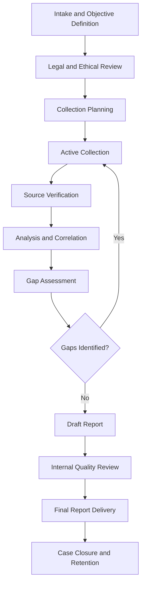

# Investigation Workflow

## Purpose Statement

This document describes the standard end-to-end workflow for conducting an OSINT investigation, from intake through closure. It is intended as an operational checklist that complements the [OSINT Collection Plan](osint-collection-plan.md) and should be used to track an investigation's progress through each stage.

---

## Workflow Overview

---

## Stage 1: Intake and Objective Definition

**Case ID:** [Unique identifier]
**Date Opened:** [Date]
**Requesting Party:** [Name/role]
**Intake Analyst:** [Name]

### Stage 1 Checklist

- [ ] Requesting party identified and authorization confirmed
- [ ] Investigation objective documented in specific, answerable terms
- [ ] Investigation type classified (person, business, technical, threat, other)
- [ ] Deadline and priority level established
- [ ] Case ID assigned and logged in case management system

### Stage 1 Notes

[Narrative notes on scope discussion with requesting party]

---

## Stage 2: Legal and Ethical Review

### Stage 2 Checklist

- [ ] Legal basis for investigation documented
- [ ] Applicable jurisdiction(s) and privacy law obligations identified
- [ ] Investigation type and subject matter checked against organizational policy for any prohibited categories
- [ ] Conflicts of interest checked and cleared
- [ ] Approval obtained from required authorizing role
- [ ] Cross-referenced against [Legal Compliance Checklist](legal-compliance-checklist.md)

**Reviewed By:** [Name] **Date:** [Date] **Outcome:** [Approved / Approved with conditions / Rejected]

**Conditions (if any):** [List any conditions attached to approval]

---

## Stage 3: Collection Planning

### Stage 3 Checklist

- [ ] [OSINT Collection Plan](osint-collection-plan.md) completed
- [ ] Priority intelligence requirements defined
- [ ] Source categories and tools identified
- [ ] Resource allocation and timeline confirmed
- [ ] Plan reviewed and approved by supervisor

---

## Stage 4: Active Collection

### Stage 4 Checklist

- [ ] Collection log created and maintained in real time
- [ ] Each source documented with URL, access date/time, and analyst name
- [ ] Evidence captured per the documentation standard (screenshot/archive/hash as applicable)
- [ ] Collection activity remains within approved scope; any scope expansion flagged for re-approval
- [ ] Sensitive or unexpectedly discovered information handled per organizational policy (see note below)

**Note on unexpected discoveries:** If collection reveals information suggesting an imminent threat to safety, evidence of a separate serious crime, or information clearly outside the approved scope, pause collection and escalate to the reviewing supervisor before proceeding.

### Collection Log Reference

[Link or reference to the case's collection log document]

---

## Stage 5: Source Verification

### Stage 5 Checklist

- [ ] Each significant finding corroborated by the minimum number of independent sources defined in the collection plan
- [ ] Source reliability rated per [Source Verification Framework](source-verification-framework.md)
- [ ] Conflicting information identified and reconciled or flagged as unresolved
- [ ] Primary sources prioritized over secondary or aggregated sources where available

---

## Stage 6: Analysis and Correlation

### Stage 6 Checklist

- [ ] Findings organized against the priority intelligence requirements from the collection plan
- [ ] Patterns, relationships, and correlations documented with supporting evidence references
- [ ] Confidence levels assigned to key assessments (High/Medium/Low with reasoning)
- [ ] Alternative explanations for ambiguous findings considered and documented

---

## Stage 7: Gap Assessment

### Stage 7 Checklist

- [ ] All priority intelligence requirements reviewed for completeness
- [ ] Outstanding gaps identified and documented
- [ ] Decision made: return to collection (Stage 4) or proceed to reporting with documented limitations

**Gap Assessment Outcome:** [Proceed to reporting / Return to collection] **Reasoning:** [Brief explanation]

---

## Stage 8: Draft Report

### Stage 8 Checklist

- [ ] Appropriate report template selected from the templates library
- [ ] Executive summary drafted
- [ ] All findings supported by cited, logged sources
- [ ] Confidence levels and limitations sections completed
- [ ] Legal/ethical considerations section completed
- [ ] Classification level assigned

---

## Stage 9: Internal Quality Review

### Stage 9 Checklist

- [ ] Peer review completed by an analyst not involved in the original collection
- [ ] Factual accuracy spot-checked against underlying evidence
- [ ] Report reviewed for objectivity, tone, and absence of unsupported conclusions
- [ ] Legal/compliance sign-off obtained where required by policy

**Reviewer:** [Name] **Date:** [Date] **Outcome:** [Approved / Revisions requested]

---

## Stage 10: Final Report Delivery

### Stage 10 Checklist

- [ ] Final report delivered to authorized distribution list only
- [ ] Delivery method complies with classification handling requirements
- [ ] Delivery confirmed and logged

---

## Stage 11: Case Closure and Retention

### Stage 11 Checklist

- [ ] Case marked closed in case management system
- [ ] All evidence and working materials stored per retention policy
- [ ] Retention period and disposal date recorded
- [ ] Lessons learned noted for process improvement, if applicable

**Retention Period:** [Duration per policy]
**Scheduled Disposal Date:** [Date, if applicable]

---

## Workflow Summary Table

| Stage | Status | Completed By | Date |
|---|---|---|---|
| 1. Intake | [Status] | [Name] | [Date] |
| 2. Legal/Ethical Review | [Status] | [Name] | [Date] |
| 3. Collection Planning | [Status] | [Name] | [Date] |
| 4. Active Collection | [Status] | [Name] | [Date] |
| 5. Source Verification | [Status] | [Name] | [Date] |
| 6. Analysis | [Status] | [Name] | [Date] |
| 7. Gap Assessment | [Status] | [Name] | [Date] |
| 8. Draft Report | [Status] | [Name] | [Date] |
| 9. Quality Review | [Status] | [Name] | [Date] |
| 10. Delivery | [Status] | [Name] | [Date] |
| 11. Closure | [Status] | [Name] | [Date] |

---

## Version Control

**Version:** [Version number]
**Last Updated:** [Date]

---

*This workflow is intended as a general-purpose structure and should be adapted to organizational policy, applicable legal requirements, and the specific nature of each investigation.*
